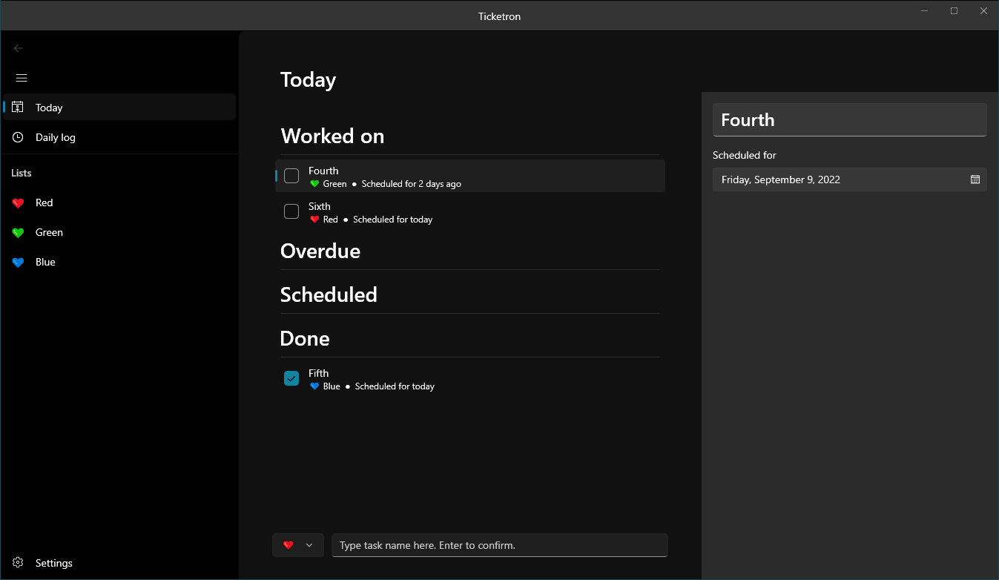
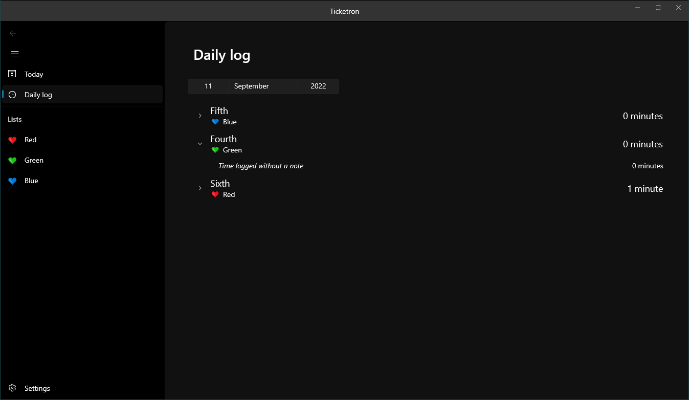

# [Ticketron](https://www.youtube.com/watch?v=eaJmgMuYNjc)

There are many to-do list apps. This one is mine.

I wrote it on a weekend and then it turned out to be nearly useless anywhere else other than my development PC because of a wrong framework choice (WinUI 3).
Then I installed [taskwarrior](https://taskwarrior.org/) and it had everything I wanted and wasn't a bloated memory-leaky mess, so this repository will likely never be used again by any living soul.

## ⚠️ DISCLAIMER ⚠️

This was written in 3 days and has had basically no testing other than me clicking around and deciding "seems solid enough".
**DO NOT USE FOR ANYTHING SERIOUS.**

If you do, and something gets lost, please don't come to complain, I warned you.
This app isn't even alpha, it's a barely-functioning MVP of a MVP.

It looks like this app leaks memory, but after profiling I don't think it's my fault.
The frontend is what looks leaky and I've been following WinUI 3 samples mostly verbatim.
[There are signs that this may not be my fault elsewhere on the web.](https://github.com/microsoft/microsoft-ui-xaml/issues/5978)

I slapped the MIT license onto this so you even don't have a legal footing to yell at me.

## Why does this even exist?

I tried out [Microsoft To Do](https://todo.microsoft.com/tasks/) for a bit.
The UI was actually quite nice, but there were a few annoyances in how it worked, and it lacked some time-tracking features I wanted while simultaneously coming with a bunch of other useless ones. So I decided to write my own rip-off on a whim.

In comparison to the aforementioned app, Ticketron is supposed to support a rather specialised workflow (i.e. mine).
It is mostly a standard to-do app, but with support for grouping tasks into individual lists, scheduling them onto particular days, and logging progress and time spent working on them.

This app is aggressively desktop, aggressively Windows, and aggressively offline, because this is the exact use case I want.
There is no cloud sync, there is no mobile version, there is no online login, and there likely never will be.
All the data resides in `My Documents\Ticketron`, and is two files: a SQLite database, and a log file if anything goes boom.

| "Today" view | "Daily log" view |
| :-: | :-: |
|  |  |

As an aside, the other reason why this exists is that putting this together is the most fun I've had in a while.
Gotta love software where you can cut scope yourself.

## Tech stack

Don't believe anything I write, check out [the `csproj`s](Ticketron.DB/Ticketron.DB.csproj) [yourself](Ticketron.App/Ticketron.App.csproj).

The above notwithstanding, the goal was to use boring technology.
Persistence is very boring: [SQLite](https://www.sqlite.org/index.html), [Dapper](https://github.com/DapperLib/Dapper), and [FluentMigrations](https://fluentmigrator.github.io/).

The frontend is considerably less boring, using [WinUI 3](https://docs.microsoft.com/en-us/windows/apps/winui/winui3/).
And wouldn't you know it, it was [by far](https://github.com/microsoft/microsoft-ui-xaml/issues/3290) [the worst](https://github.com/microsoft/microsoft-ui-xaml/issues/5978) library choice of them all.
On top of that, there are a few more libraries, but all boring: [Serilog](https://serilog.net/) with a file sink for logging (I would use the bog-standard `Microsoft.Extensions.Logging`, [but they don't want to support logging to files](https://github.com/aspnet/Logging/issues/441), and so Serilog is the next least-easily exploitable library), [Humanizer](https://github.com/Humanizr/Humanizer) for user-facing faff, and [`CommunityToolkit.MVVM`](https://docs.microsoft.com/en-us/windows/communitytoolkit/mvvm/introduction) to save myself from typing a metric ton of hand-rolled `INotifyPropertyChanged` implementations.

## Why are you still reading this?

Did I mention: **DON'T USE THIS**?
